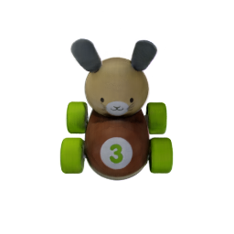

# ObjectNet

### Data Preparation
  * `modelhaven`: 1-20.
  * `GoogleScannedObjects`: 21-72.
  * `ycb`: 73-100.
```
  $ cd blender
  $ blender -b -P gpu.py -E CYCLES --python generate_{modelhaven/GoogleScannedObject/ycb}_views.py \
     -- --mesh_file path_of_obj_file \
     --mtl_file path_of_mtl_file \
     --results_path path_to_save_results
```
This code can be given with the following command-line arguments:
  * `--mesh_file`: the path of the obj file.
  * `--mtl_file`: the path of the mtl file.
  * `--results_path`: the path to save results.
  * `--radius`: the radius of the sphere, default is 2.5.
  * `--random_views`: randomly put the camera on the sphere or not, default is false.
  * `--upper_views`: put the camera on the upper hemisphere or not, default is false.

For example:
```
  $ blender -b -P gpu.py -E CYCLES --python generate_modelhaven_views.py \
       -- --mesh_file ../object/1/GothicCabinet_01.obj \
       --mtl_file ../object/1/GothicCabinet_01.mtl \
       --results_path ../object/1/data/train \
       --random_views 
```

### Rendering images, audios, and touch tactiles
```
  $ python evaluate.py --object_file_path path_of_ObjectFile \
      --vision_test_file_path path_of_vision_test_file \
      --vision_results_dir path_of_vision_results_directory \
      --audio_vertex_file_path path_of_audio_testing_vertex_file \
      --audio_forces_file_path path_of_forces_file \
      --audio_results_dir path_of_audio_results_directory \
      --touch_vertex_file_path path_of_touch_testing_vertex_file \
      --touch_results_path path_of_touch_results_directory
```
This code can be given with the following command-line arguments:
  * `--object_file_path`: The path of ObjectFile.
  * `--vision_test_file_path`: The path of vision testing file, which should be a json file.
  * `--vision_results_dir`: The path of vision results directory to save rendered images.
  * `--audio_vertex_file_path`: The path of audio testing vertex file, which should be a npy file.
  * `--audio_forces_file_path`: The path of forces file, which should be a npy file.
  * `--audio_results_dir`: The path of audio results directory to save rendered audio wav files.
  * `--touch_vertex_file_path`: The path of touch testing vertex file, which should be a npy file.
  * `--touch_results_dir`: The path of touch results directory to save rendered touch tactile images.

For example:
```
  $ python evaluate.py --object_file_path ../Objects/25/ObjectFile.pth \
      --vision_test_file_path demo/vision_demo.npy \
      --vision_results_dir demo/vision_results/ \
      --audio_vertices_file_path demo/audio_demo_vertices.npy \
      --audio_forces_file_path demo/audio_demo_forces.npy \
      --audio_results_dir demo/audio_results/ \
      --touch_vertices_file_path demo/touch_demo_vertices.npy \
      --touch_results_dir demo/touch_results/
```

The rendered images will be saved in `demo/vision_results/`.
<p float="middle">
  
  
  
  
</p>
