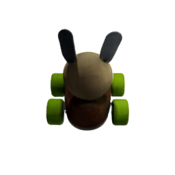
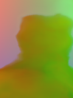

## ObjectFolder: A Dataset of Objects with Implicit Visual, Auditory, and Tactile Representations (CoRL 2021)
[[Project Page]](https://ai.stanford.edu/~rhgao/objectfolder/)    [[arXiv]](https://arxiv.org/abs/2109.07991) 


<br/>

[ObjectFolder: A Dataset of Objects with Implicit Visual, Auditory, and Tactile Representations](https://arxiv.org/abs/2109.07991)  
 [Ruohan Gao](https://www.ai.stanford.edu/~rhgao/),  [Yen-Yu Chang](https://yuyuchang.github.io/),  [Shivani Mall](), [Li Fei-Fei](https://profiles.stanford.edu/fei-fei-li), [Jiajun Wu](https://jiajunwu.com/)<br/>
 Stanford University  
 In Conference on Robot Learning (**CoRL**), 2021  
 
<br/>

If you find our code or project useful in your research, please cite:

    @inproceedings{gao2021ObjectFolder,
      title = {ObjectFolder: A Dataset of Objects with Implicit Visual, Auditory, and Tactile Representations},
      author = {Gao, Ruohan and Chang, Yen-Yu and Mall, Shivani and Fei-Fei, Li and Wu, Jiajun},
      booktitle = {CoRL},
      year = {2021}
    }

### Rendering images, audios, and touch tactiles
Run the following command to render images, audios, and tactile RGB images.
```
  $ python evaluate.py --object_file_path path_of_ObjectFile \
      --vision_test_file_path path_of_vision_test_file \
      --vision_results_dir path_of_vision_results_directory \
      --audio_vertices_file_path path_of_audio_testing_vertices_file \
      --audio_forces_file_path path_of_forces_file \
      --audio_results_dir path_of_audio_results_directory \
      --touch_vertices_file_path path_of_touch_testing_vertices_file \
      --touch_results_path path_of_touch_results_directory
```
This code can be given with the following command-line arguments:
  * `--object_file_path`: The path of ObjectFile.
  * `--vision_test_file_path`: The path of vision testing file, which should be a npy file.
  * `--vision_results_dir`: The path of vision results directory to save rendered images.
  * `--audio_vertices_file_path`: The path of audio testing vertices file, which should be a npy file.
  * `--audio_forces_file_path`: The path of forces file, which should be a npy file.
  * `--audio_results_dir`: The path of audio results directory to save rendered audio wav files.
  * `--touch_vertices_file_path`: The path of touch testing vertices file, which should be a npy file.
  * `--touch_results_dir`: The path of touch results directory to save rendered tactile RGB images.

### Data format
  * `--vision_test_file_path`: It is a npy file with shape as (N, 6), where N is the number of testing viewpoints. Each data point represents the coordinates of the camera and the light. It should be (camera_x, camera_y, camera_z, light_x, light_y, light_z).
  * `--audio_vertices_file_path`: It is a npy file with shape as (N, 3), where N is the number of audio testing vertices on objects. Each data point represents the coordinates on objects. It should be (x, y, z).
  * `--audio_forces_file_path`: It is a npy file with shape as (N, 3), where N is the number of audio testing vertices on objects. Each data point represents the forces on coordinates. It should be (F_x, F_y, F_z).
  * `--touch_vertices_file_path`: It is a npy file with shape as (N, 3), where N is the number of touch testing vertices on objects. Each data point represents the coordinates on objects. It should be (x, y, z).

### Demo
For example:
```
  $ python evaluate.py --object_file_path ../Objects/25/ObjectFile.pth \
      --vision_test_file_path demo/vision_demo.npy \
      --vision_results_dir demo/vision_results/ \
      --audio_vertices_file_path demo/audio_demo_vertices.npy \
      --audio_forces_file_path demo/audio_demo_forces.npy \
      --audio_results_dir demo/audio_results/ \
      --touch_vertices_file_path demo/touch_demo_vertices.npy \
      --touch_results_dir demo/touch_results/
```

The rendered images will be saved in `demo/vision_results/`.
<p float="middle">
  
  
  
  
</p>

Then rendered audios will be saved in `demo/audio_results/`.
TODO...

The rendered touch tactile RGB images will be saved in `demo/touch_results/`.
<p float="middle">
  
  
  
  
</p>
